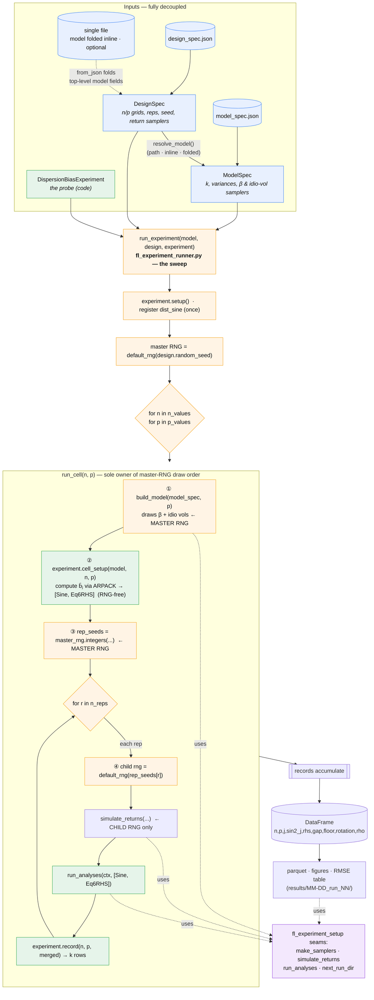

# Dispersion-Bias Verification — Architecture Flowchart

Three decoupled layers: a generic engine in two files — **setup**
(`fl_experiment_setup`: specs, the `Experiment` protocol, `build_model`, and the
stateless seams) and **runner** (`fl_experiment_runner`: the sweep) — plus a
theorem-specific **probe** (`sim_theorem_partii`). The engine knows nothing about
dispersion bias; a new theorem is a new `Experiment` with no engine change.

## Control flow + master-RNG draw order



The draw order — **① build_model → ③ rep_seeds → ④ child generators** — is what
every downstream number depends on. The probe's hooks (② `cell_setup`, ⑦/⑧
analysis + record) never touch the master RNG, so swapping in a different
`Experiment` cannot perturb reproducibility.

## Layer responsibilities

```mermaid
flowchart LR
    subgraph L1["fl_experiment_setup.py · setup"]
        direction TB
        E1["ModelSpec · DesignSpec"]
        E2["Experiment (Protocol)"]
        E3["build_model (Stage 1)"]
        S1["make_samplers / make_one_sampler"]
        S2["simulate_returns (Stages 2–4)"]
        S3["run_analyses (dispatch)"]
        S4["next_run_dir (output bookkeeping)"]
    end
    subgraph L2["fl_experiment_runner.py · runner"]
        direction TB
        E4["run_experiment (the sweep)"]
        E5["run_cell · nested sampling"]
    end
    subgraph L3["sim_theorem_partii.py · probe"]
        direction TB
        P1["SineAlignmentAnalysis"]
        P2["Eq6RHSAnalysis"]
        P3["DispersionBiasExperiment"]
        P4["main() CLI · simulate() one-call driver"]
    end
    L3 -->|"run_experiment(model, design, probe)"| L2
    L2 -->|"uses specs · build_model · seams"| L1

    classDef seam fill:#f3e8fd,stroke:#9b51e0,color:#111;
    classDef engine fill:#fff4e5,stroke:#f5a623,color:#111;
    classDef probe fill:#e6f4ea,stroke:#34a853,color:#111;
    class S1,S2,S3,S4 seam;
    class E1,E2,E3,E4,E5 engine;
    class P1,P2,P3,P4 probe;
```



`Experiment` is the only theorem-specific surface: implement `setup()` /
`cell_setup(model, n, p)` / `record(n, p, merged)` and hand it to
`run_experiment`. The seams and engine are reused verbatim.

---

### ASCII fallback (for PDF / no-Mermaid renderers)

```
INPUTS (decoupled)                         model_spec.json ─┐
                                                            ├─► ModelSpec ─┐
  design_spec.json ─► DesignSpec ─(model: path|inline|folded)──┘          │
  single file (model fields at top level) ─from_json folds─► DesignSpec
  DispersionBiasExperiment (probe) ───────────────────────────────┐      │
                                                                   ▼      ▼
ENGINE  fl_experiment_runner.run_experiment(model, design, experiment)
        │
        ├─ experiment.setup()                 register dist_sine (once)
        ├─ master RNG = default_rng(seed)
        └─ for n in n_values:  for p in p_values:   ── run_cell(n,p) ──┐
                                                                       │
           ┌───────────────────────────────────────────────────────┐ │
           │ run_cell  (owns master-RNG draw order)                 │ │
           │  ① build_model(p)        draws β,idio ← MASTER RNG      │ │
           │  ② experiment.cell_setup(model) → [Sine,Eq6RHS]  (RNG-free)
           │  ③ rep_seeds            ← MASTER RNG                    │ │
           │  ④ for r in n_reps:                                    │ │
           │       child rng = default_rng(rep_seeds[r])            │ │
           │       simulate_returns(...)   ← CHILD RNG only         │ │
           │       run_analyses(ctx,[Sine,Eq6RHS])                  │ │
           │       experiment.record(n,p,merged) → k rows           │ │
           └───────────────────────────────────────────────────────┘ │
                                                                       ▼
OUTPUT   DataFrame[n,p,j,sin2_j,rhs,gap,floor,rotation,rho]
         └─► parquet · figures · RMSE table   (results/MM-DD_run_NN/)

SEAMS (fl_experiment_setup, reused by the runner):
  make_samplers · simulate_returns · run_analyses · next_run_dir
```
