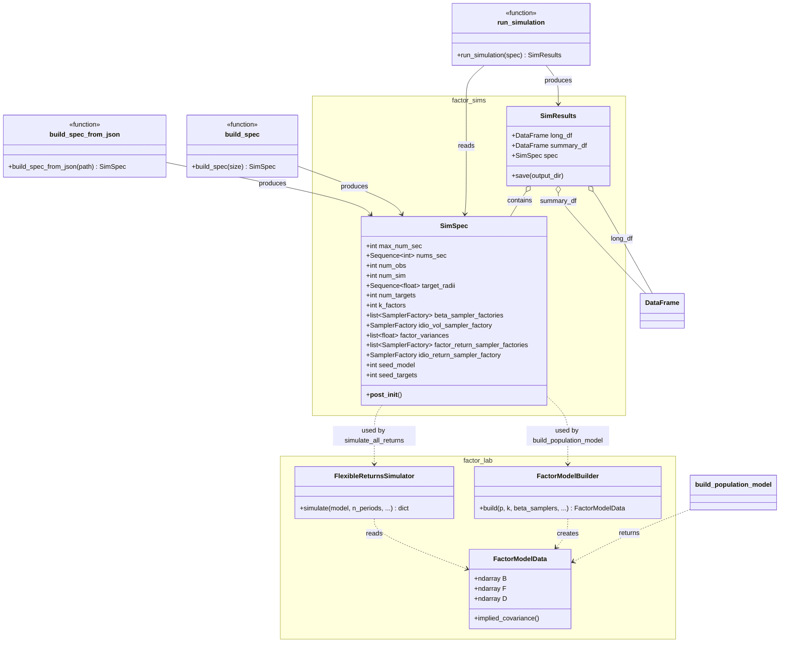
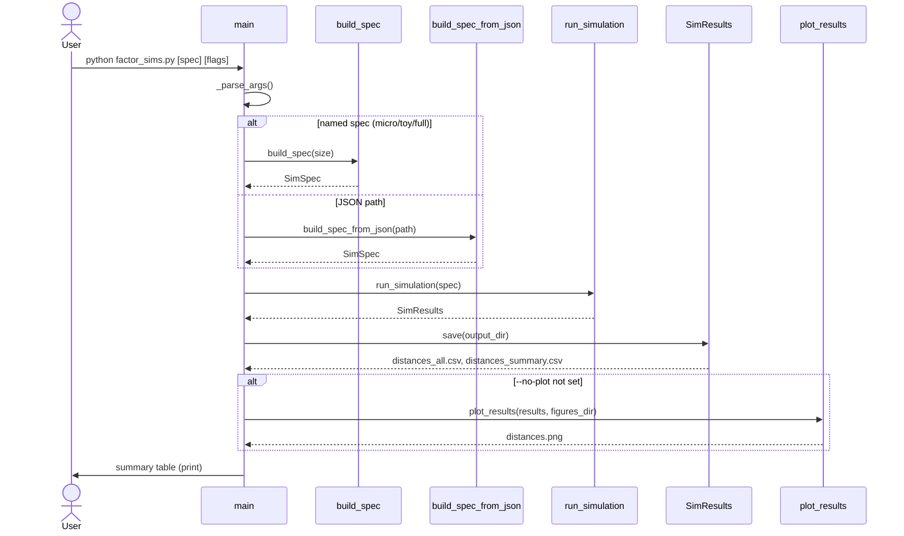
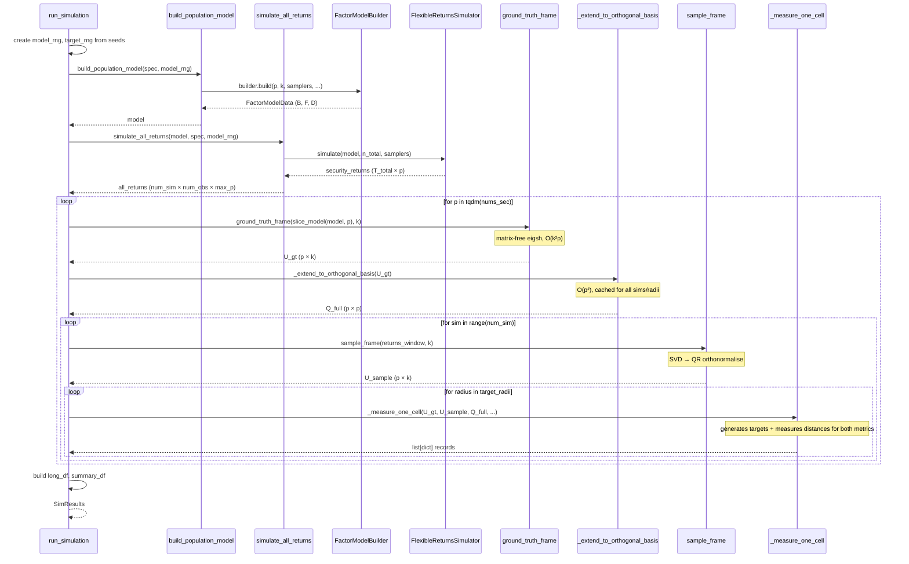
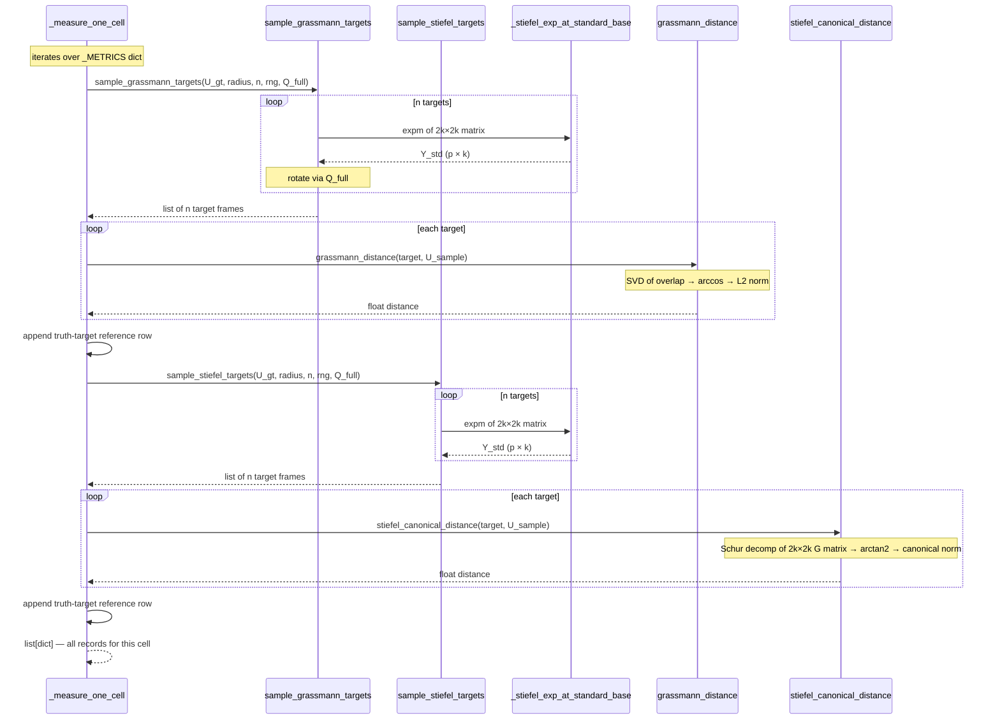
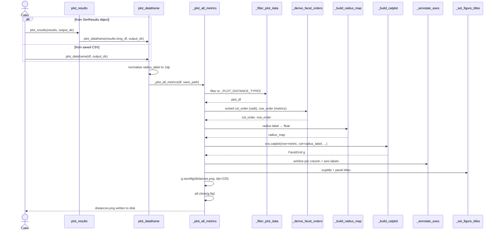

# `factor_sims.py` and `factor_sims_plots.py` — Technical Documentation

## Table of Contents

1. [Research context](#1-research-context)
2. [Module overview](#2-module-overview)
3. [factor_sims.py — detailed reference](#3-factor_simspy--detailed-reference)
   - [SimSpec — the experiment configuration](#31-simspec--the-experiment-configuration)
   - [Model and returns generation](#32-model-and-returns-generation)
   - [Frame extraction](#33-frame-extraction)
   - [Target generation](#34-target-generation)
   - [Distance measurement](#35-distance-measurement)
   - [SimResults — output container](#36-simresults--output-container)
   - [The simulation loop](#37-the-simulation-loop)
   - [Pre-configured specs and JSON loading](#38-pre-configured-specs-and-json-loading)
   - [CLI](#39-cli)
4. [factor_sims_plots.py — detailed reference](#4-factor_sims_plotspy--detailed-reference)
5. [Module interaction](#5-module-interaction)
6. [Key design decisions and why](#6-key-design-decisions-and-why)
7. [Output schema](#7-output-schema)
8. [Performance characteristics](#8-performance-characteristics)
9. [UML class diagram](#9-uml-class-diagram)
10. [UML sequence diagrams](#10-uml-sequence-diagrams)

---

## 1. Research context

This simulation infrastructure supports a generalisation of the
Goldberg–Papanicolaou–Shkolnik *dispersion bias* result. The original paper
shows that when estimating a single-factor model from finite data, the sample
eigenvector is systematically pushed *away* from the equal-weight direction
on the sphere S^{p-1}. The research question here is: does this bias persist,
and how does it scale, when there are *k > 1* factors — i.e. when the relevant
geometry is the Grassmannian Gr(p, k) or the Stiefel manifold St(p, k)?

The simulation answers this by:

1. Building a population factor model with known factor subspace B^GT.
2. Drawing noisy finite samples and estimating the factor subspace B^S via SVD.
3. Placing random "target" frames at prescribed geodesic distances from B^GT.
4. Measuring how far B^S is from each target, under both the Grassmann and
   Stiefel canonical metrics.

If B^S is unbiased, its distances to targets placed symmetrically around B^GT
should be centred on the nominal radius. Systematic deviation from the radius —
i.e. B^S being consistently closer to or further from targets than the nominal
distance — is the measurable signature of dispersion bias on the manifold.

---

## 2. Module overview

```
factor_sims.py          Core simulation engine
factor_sims_plots.py    Visualisation layer (seaborn catplot)
```

`factor_sims.py` is self-contained: it runs, saves CSVs, and (if
`factor_sims_plots` is importable) generates figures. The plot module is
deliberately decoupled — it accepts any conformant DataFrame, so you can
re-plot saved CSVs without re-running the simulation.

### Dependency graph

```
factor_sims.py
    ├── factor_lab          (FactorModelData, FactorModelBuilder,
    │                        FlexibleReturnsSimulator, create_sampler,
    │                        svd_decomposition)
    ├── scipy.linalg        (expm, null_space, qr, schur)
    ├── scipy.sparse.linalg (eigsh, LinearOperator)
    ├── numpy, pandas
    ├── loguru, tqdm
    └── [optional] factor_sims_plots

factor_sims_plots.py
    ├── matplotlib, seaborn, pandas
    └── loguru
```

---

## 3. `factor_sims.py` — detailed reference

### 3.1 SimSpec — the experiment configuration

`SimSpec` is a frozen parameter bundle. Every knob for one simulation run
lives here: what model to build, how many returns to draw, what distances
to measure, and what random seeds to use.

```python
@dataclass
class SimSpec:
    max_num_sec: int          # population size — model built at this p
    nums_sec: Sequence[int]   # p-slices to measure; must all be ≤ max_num_sec
    num_obs: int              # observations per return window (e.g. 63 = one quarter)
    num_sim: int              # independent return windows per p-slice
    target_radii: Sequence[float]  # geodesic radii at which to place targets
    num_targets: int          # targets per (p, sim, radius, metric) cell
    k_factors: int            # number of factors

    # --- sampler factories (see below) ---
    beta_sampler_factories: list[SamplerFactory]
    idio_vol_sampler_factory: SamplerFactory
    factor_variances: list[float]
    factor_return_sampler_factories: list[SamplerFactory]
    idio_return_sampler_factory: SamplerFactory

    seed_model: int = 42      # seeds model construction + return draws
    seed_targets: int = 12345 # seeds target direction generation only
```

#### Why sampler *factories* instead of live samplers

This is the most important design decision in `SimSpec` and is easy to
misunderstand. The problem it solves is reproducibility.

A `Sampler` is a live object bound to a `numpy.random.Generator`. Every
time you call a sampler it draws from the generator and advances its
internal state. If you stored live samplers in `SimSpec`, two consecutive
calls to `run_simulation(spec)` would *not* produce the same output: the
second call would start drawing from wherever the first call left off.

A `SamplerFactory` is a small function that *makes* a sampler when given a
generator. It captures the distribution parameters (e.g. `loc=1.0,
scale=0.5`) at definition time but does not touch any generator until called.

`run_simulation` creates a brand-new generator — reset to the same starting
state from `spec.seed_model` — on every call, then passes it to each
factory. The result: identical seeds always produce identical output,
regardless of how many times you call `run_simulation`.

```python
# Factory: knows the distribution but holds no generator yet
beta_factory = lambda rng: create_sampler('normal', rng, loc=1.0, scale=0.5)

# Inside run_simulation (simplified):
model_rng = np.random.default_rng(spec.seed_model)   # reset to same state
beta_sampler = beta_factory(model_rng)                # now it's live
```

#### Two independent seeds

`seed_model` controls the random state for everything that determines
the factor model and returns: loading values, idiosyncratic variances, and
all return draws.

`seed_targets` controls only the random directions in which targets are
placed around B^GT. Keeping them separate lets you:

- Hold the model and returns fixed while varying target placement (to check
  that the bias finding isn't sensitive to which particular target directions
  you happened to sample).
- Hold target placement fixed while varying the model (to aggregate bias
  measurements across multiple independent models at the same target geometry).

#### Validation

`__post_init__` enforces:
- All sampler factory lists have length exactly k.
- `max(nums_sec) ≤ max_num_sec` (can't slice to more assets than the model has).
- `min(nums_sec) ≥ 2k` (the Stiefel exponential map requires p ≥ 2k).
- `num_obs`, `num_sim`, `num_targets` all positive.

---

### 3.2 Model and returns generation

#### `build_population_model(spec, rng) → FactorModelData`

Wraps `factor_lab.FactorModelBuilder` to produce a three-component factor
model:

- **B** (k × p): factor loading matrix. Row i gives the sensitivity of all p
  assets to factor i. Drawn from the beta samplers.
- **F** (k × k): factor covariance matrix. Diagonal, with entries given by
  `spec.factor_variances`.
- **D** (p × p): idiosyncratic covariance matrix. Diagonal, with per-asset
  variances drawn from the idio vol sampler.

The implied return covariance for any p-slice is:

```
Σ_p = B_p^T F B_p + D_p
```

where B_p = B[:, :p] and D_p = D[:p, :p].

#### `simulate_all_returns(model, spec, rng) → ndarray (num_sim, num_obs, max_num_sec)`

Draws all return data in one contiguous block:
`n_total = num_obs × num_sim` periods, for all `max_num_sec` assets.

The big single call amortizes simulator overhead. The result is reshaped
into `(num_sim, num_obs, max_num_sec)` — a stack of `num_sim` independent
windows, each containing `num_obs` time periods and `max_num_sec` assets.
The reshape is zero-copy (a numpy view).

When sliced for a specific p, `all_returns[sim, :, :p]` gives one
`(num_obs × p)` return window, matching what an econometrician would observe
for p assets over one quarter.

#### `slice_model(model, p) → FactorModelData`

Restricts the full model to the first p assets by slicing B and D. F is
untouched — it is k×k and does not depend on p.

**Important:** using one population model and slicing to each p is an
explicit design choice. It conflates subset-selection effects with genuine
dimension effects. The KT document notes this artifact. An alternative
would be to build an independent model for each p, but the current design
was chosen deliberately for this phase of the research.

---

### 3.3 Frame extraction

#### `ground_truth_frame(model_slice, k) → ndarray (p, k)`

Computes B^GT: the top-k eigenvectors of the population covariance
`M_p = B_p^T F B_p + D_p`, in descending eigenvalue order.

This is what an oracle with perfect knowledge of the true model would
estimate. It is the "target" that finite-sample estimation is trying to
reach.

**Why these eigenvectors, not the raw loadings B?**
Because this is what an observer estimating from returns would obtain: they
would compute the sample covariance and take its leading eigenvectors. The
population counterpart is the leading eigenvectors of the true covariance,
not the raw loading matrix.

**The matrix-free approach:**
The naive implementation would form the full `(p, p)` matrix and call
`scipy.linalg.eigh`. At p = 10,000 this costs ~800 MB of memory and ~4
seconds. Instead we exploit the rank-k-plus-diagonal structure:

```
M_p x = D_p x + B_p^T (F (B_p x))
```

Each matrix-vector product costs O(kp) — two small matrix multiplications.
`scipy.sparse.linalg.eigsh` uses the Lanczos algorithm, which finds the
top-k eigenvectors with O(k) matrix-vector products. Total cost: O(k²p).

At p = 10,000, k = 3: this takes under 1 ms with negligible memory, versus
4 seconds and 800 MB for the dense approach.

#### `sample_frame(returns_window, k) → ndarray (p, k)`

Computes B^S: the top-k frame estimated from a finite sample of returns.

Uses `factor_lab.svd_decomposition` on the `(num_obs × p)` return window,
then orthonormalises the loading rows via QR. The result is a `(p, k)`
orthonormal frame — the "sample" estimate of the factor subspace.

---

### 3.4 Target generation

Targets are frames placed at *exact* prescribed geodesic distances from B^GT.
They serve as reference points: if B^S is unbiased, its distance to targets
should be centred on the nominal radius.

#### The geodesic construction

Both target generators use the same underlying algorithm:

1. Draw a random tangent vector at B^GT by generating:
   - A11 (k×k): a random skew-symmetric matrix (vertical component, generates
     rotation within the k-plane)
   - A21 ((p-k)×k): a random matrix (horizontal component, tilts the k-plane
     in new directions)

2. Rescale to the target radius using the Stiefel canonical metric:
   ```
   ‖(A11, A21)‖_canonical = sqrt(½‖A11‖_F² + ‖A21‖_F²)
   ```
   The ½ weight on A11 reflects that vertical motion (rotation within the
   subspace) is "cheaper" under the canonical metric than horizontal motion
   (changing the subspace itself).

3. Compute the geodesic endpoint using the **2k×2k matrix exponential
   reduction** (Edelman, Arias & Smith, 1998). Instead of a p×p matrix
   exponential, we:
   - QR-decompose A21 = U_A R_A to isolate the active k-dimensional subspace.
   - Exponentiate the 2k×2k matrix `[[A11, -R_A^T], [R_A, 0]]`.
   - Reconstruct the p×k result: `Y_std[:k] = Y_tilde[:k]`,
     `Y_std[k:] = U_A @ Y_tilde[k:]`.

4. Rotate from the standard base point `[I_k; 0]` to B^GT via the pre-computed
   full orthogonal basis `Q_full = [B^GT | null_space(B^GT^T)]`.

This construction guarantees the canonical tangent norm equals the requested
radius to machine precision (verified in `test_stiefel_tangent_norm_exact`).

#### `sample_stiefel_targets(U_base, radius, n, rng, Q_full=None)`

Generates n targets at exact Stiefel canonical distance `radius` from U_base.
Both A11 and A21 are drawn randomly, giving a mix of vertical and horizontal
motion.

#### `sample_grassmann_targets(U_base, radius, n, rng, Q_full=None)`

The Grassmann special case: A11 = 0, pure horizontal motion only. With no
vertical component, the canonical norm reduces to ‖A21‖_F, and the target
has zero SO(k) rotation relative to U_base. Grassmann distance equals Stiefel
distance equals radius.

#### The `Q_full` pre-computation optimisation

`Q_full = [U_base | null_space(U_base^T)]` is an orthogonal p×p matrix that
maps the standard base `[I_k; 0]` to U_base. Computing `null_space` is O(p²).

Without pre-computation, it would be called inside every target generation
function — once per `(sim, radius, metric)` triple within each p-slice. The
`Q_full` argument allows the caller to pass the pre-computed basis, reducing
the call count from `num_sim × num_radii × 2` to once per p-slice.

---

### 3.5 Distance measurement

#### `grassmann_distance(U1, U2) → float`

Measures the angle between the k-planes spanned by U1 and U2, ignoring any
rotation of basis vectors within those planes.

```
d_G(U1, U2) = ‖(θ₁, ..., θ_k)‖₂
```

where θ_i are the principal angles, computed via SVD of the overlap
`U1^T @ U2`. The singular values are cos(θ_i); arccos converts them to angles.

This is the natural metric on the Grassmannian Gr(p, k). Two frames that span
the same k-plane but use different orthonormal bases have Grassmann distance 0.

#### `stiefel_canonical_distance(U1, U2) → float`

Measures geodesic distance on the Stiefel manifold St(p, k), which *does*
distinguish different orthonormal bases for the same k-plane. Two frames
differing only by an SO(k) rotation within the plane have Grassmann distance 0
but positive Stiefel canonical distance.

The distance is computed via the canonical metric weights:
```
d_S² = ½‖A11‖_F² + ‖A21‖_F²
```

where (A11, A21) is the tangent vector at U1 pointing toward U2, extracted
by taking the matrix logarithm of the 2k×2k block rotation matrix G:

```
G = [[U1^T U2,  -R^T],
     [R,         U1^T U2]]
```

where R comes from the QR decomposition of the residual `(I - U1 U1^T) U2`.

**The Schur optimisation:**
The naive implementation uses `scipy.linalg.logm(G)`, which internally
applies a Padé approximant series. For a 6×6 matrix (k=3), this takes ~6 ms.

Since G is a rotation matrix, its real Schur decomposition has 2×2 diagonal
blocks of the form `[[cos θ, -sin θ], [sin θ, cos θ]]`. The matrix logarithm
of each such block is analytically `[[0, -θ], [θ, 0]]`. No approximant series
is needed — just `arctan2` calls. This reduces cost to ~0.2 ms, a ~30x
speedup that is crucial for the hot loop.

**Precision note:** The Schur approach is slightly less accurate than logm at
large radii (r=1.0: max error ~4e-2 vs ~1e-2). This is within the documented
test tolerances and appropriate for the hot-loop use case.

---

### 3.6 SimResults — output container

```python
@dataclass
class SimResults:
    long_df: pd.DataFrame    # every individual distance measurement
    summary_df: pd.DataFrame # per-cell aggregates
    spec: SimSpec            # the spec that produced these results
```

`save(output_dir)` writes:
- `distances_all.csv` — the full long-form data (see §7)
- `distances_summary.csv` — grouped statistics

---

### 3.7 The simulation loop

`run_simulation(spec)` is the outermost loop. Its structure:

```
for p in tqdm(nums_sec):                   # outer: p-slices
    U_gt = ground_truth_frame(...)         # once per p
    Q_full = _extend_to_orthogonal_basis() # once per p (expensive, cached)

    for sim in range(num_sim):             # middle: return windows
        U_sample = sample_frame(...)       # one SVD per sim

        for radius in target_radii:        # inner: target radii
            _measure_one_cell(...)         # generates and measures targets
```

`_measure_one_cell` iterates over both metrics (grassmann, stiefel-canonical),
generating `num_targets` targets per metric and measuring the distance from
each target to U_sample. It also appends one `truth-target` reference row
per metric per radius (distance = radius exactly, by construction).

The `_METRICS` dispatch dictionary maps metric names to `(sampler, distance_fn)`
pairs, making it straightforward to add new metrics without touching the loop.

---

### 3.8 Pre-configured specs and JSON loading

#### `build_spec(size)` — named presets

| Size    | max_p  | p-slices                          | num_sim | num_targets | ~Runtime |
|---------|--------|-----------------------------------|---------|-------------|----------|
| `micro` | 100    | (30, 60, 100)                     | 3       | 3           | ~1 s     |
| `toy`   | 500    | (50, 100, 250, 500)               | 10      | 5           | ~11 s    |
| `full`  | 10,000 | (100, 500, 1000, 3000, 5000, 10000)| 100    | 20          | ~5 min   |

All use `num_obs = 63` (one trading quarter), `target_radii = (0.1, 0.5, 1.0)`,
`k_factors = 3`, and the default samplers (N(1, 0.5), N(0,1), N(0,1) for
loadings; U(0.1, 5) for idio vols).

#### `build_spec_from_json(path)` — custom specs

Any subset of the numeric fields can be overridden via a JSON file. Sampler
distributions cannot be set via JSON because Python callables are not
serialisable. The JSON spec inherits unspecified fields from the `full`
preset defaults.

Example JSON:
```json
{
    "max_num_sec": 2000,
    "nums_sec": [100, 500, 1000, 2000],
    "num_obs": 126,
    "num_sim": 50,
    "target_radii": [0.1, 0.3, 0.5, 1.0],
    "num_targets": 10,
    "k_factors": 3,
    "factor_variances": [0.0025, 0.01, 0.01],
    "seed_model": 99,
    "seed_targets": 777
}
```

---

### 3.9 CLI

```
python factor_sims.py [spec] [--output DIR] [--seed-model N]
                              [--seed-targets N] [--no-plot]
```

`spec` is either a named preset (`micro`, `toy`, `full`, default `toy`)
or a path to a JSON file.

After the simulation completes, `main()` automatically imports
`factor_sims_plots` and calls `plot_results()` unless `--no-plot` is given.
If the plot module is not found, a warning is logged and execution continues.

---

## 4. `factor_sims_plots.py` — detailed reference

This module has one job: turn a long-form distance DataFrame into a
single publication-ready figure. It is deliberately stateless — no classes,
no mutable globals, just functions operating on DataFrames.

### Public API

#### `plot_results(results, output_dir)`

Entry point when you have a live `SimResults` object. Delegates to
`plot_dataframe(results.long_df, output_dir)`.

#### `plot_dataframe(df, output_dir)`

Entry point when working from a saved CSV. Normalises `radius_label` to
one decimal place (reconciling `r=0.10` from `factor_sims` with `r=0.1`
from the older simulation), then calls `_plot_all_metrics`.

### Output

A single `distances.png` with:
- **Rows**: one per metric (alphabetical: `grassmann` on top,
  `stiefel-canonical` below)
- **Columns**: one per target radius
- **x-axis**: ambient dimension p
- **y-axis**: distance (independent scale per row — Grassmann and Stiefel
  canonical distances have different magnitudes)
- **Box plots**: distribution of `sample-target` distances across the
  `num_sim × num_targets` measurements at each p
- **Dashed reference line**: the nominal target radius for that column

### Why `sample-target` only, not `truth-target`

`truth-target` rows have `distance == radius` by construction — they carry
no distributional information. A box plot of them would be a flat line at
the reference, which the dashed line already shows. Including them would
clutter the plot without adding information.

### Plot constants

All styling is centralised at the top of the module. To restyle globally:

```python
# Change plot size
factor_sims_plots._CATPLOT_KW['height'] = 4.0

# Add outliers back
factor_sims_plots._CATPLOT_KW['showfliers'] = True

# Add truth-target boxes
factor_sims_plots._PLOT_DISTANCE_TYPES = ("sample-target", "truth-target")
```

### CLI

```
python factor_sims_plots.py distances_all.csv [--output DIR]
```

Loads a saved CSV and re-plots without re-running the simulation.

---

## 5. Module interaction

### Normal flow (integrated)

```python
from factor_sims import build_spec, run_simulation
from factor_sims_plots import plot_results

spec = build_spec('full')
results = run_simulation(spec)        # returns SimResults
results.save('output/')               # writes CSVs
plot_results(results, 'output/figures')  # writes distances.png
```

### Decoupled re-plot flow

```python
import pandas as pd
from factor_sims_plots import plot_dataframe

df = pd.read_csv('output/distances_all.csv')
plot_dataframe(df, 'output/figures/')   # re-plot without re-running
```

### CLI flow (automatic integration)

When `factor_sims.py` is run from the command line, it attempts to import
`factor_sims_plots` automatically and call `plot_results` after saving CSVs.
If the plot module is missing or matplotlib is unavailable, a warning is
logged and the run completes with CSVs only.

### Data contract between modules

`factor_sims_plots` requires a DataFrame with these columns:

| Column         | Type    | Description                                      |
|----------------|---------|--------------------------------------------------|
| `p`            | int     | Ambient dimension                                |
| `n`            | int     | Observation count                                |
| `radius`       | float   | Nominal target radius                            |
| `radius_label` | str     | Human-readable radius label (normalised to 1dp)  |
| `metric`       | str     | `'grassmann'` or `'stiefel-canonical'`           |
| `distance_type`| str     | `'sample-target'` or `'truth-target'`            |
| `distance`     | float   | Measured geodesic distance                       |
| `rep`          | int     | Simulation replicate index                       |
| `dimension`    | int     | Number of factors k                              |

The plot module normalises `radius_label` itself, so passing the raw CSV
output from `factor_sims` (which uses two decimal places) works correctly.

---

## 6. Key design decisions and why

### Why Grassmann *and* Stiefel canonical metrics?

The Grassmann metric ignores the orientation of basis vectors within the
k-plane — it only cares about which directions the plane covers. The Stiefel
canonical metric distinguishes different orthonormal frames for the same
plane.

For the dispersion bias question, this matters: bias might manifest in the
orientation of the estimated eigenvectors (Stiefel) even when the subspace
itself is estimated accurately (Grassmann). Measuring both allows the
research to distinguish these two sources of error.

### Why the Schur decomposition instead of `logm`?

`scipy.linalg.logm` uses a Padé approximant series internally — a general
method that works for any matrix. For a rotation matrix, the matrix logarithm
has a direct closed form based on the eigenangles. The Schur decomposition
exposes those angles via `arctan2`, bypassing the approximant series entirely.

At k=3, the 6×6 matrix computation drops from ~6 ms to ~0.2 ms. Over
36,000 calls in the full spec, this reduces the dominant runtime cost from
~210 seconds to ~7 seconds.

### Why a single population model sliced to each p?

Building one model at `max_num_sec` and slicing to smaller p values means the
smaller-p results are nested subsets of the full model — the first p assets
are always the same regardless of which p you're examining.

This conflates two effects: genuine high-dimensionality effects (what the
research is interested in) and subset-selection effects (which assets happen
to be in the first p). It's an acknowledged limitation. The alternative is
building an independent model for each p, which would require a separate
design and is left as future work.

### Why one big return draw reshaped, not many small draws?

Drawing `num_obs × num_sim` periods in one call and reshaping into
`num_sim` windows amortizes the overhead of the sampler infrastructure.
The reshape is zero-copy (a numpy view), so there's no memory cost.

### Why `SamplerFactory` instead of just passing distributions as strings?

String-based distribution specs (e.g. `"normal(0, 1)"`) would require an
eval-based parser and would limit expressiveness. The factory pattern supports
arbitrary Python distributions, transformations (e.g. absolute values,
truncation), and composed samplers without any special-case parsing.

---

## 7. Output schema

### `distances_all.csv` — long-form data

One row per distance measurement.

| Column         | Values                                      |
|----------------|---------------------------------------------|
| `dimension`    | k (number of factors)                       |
| `p`            | ambient dimension for this slice            |
| `n`            | num_obs (observations per window)           |
| `radius`       | nominal target radius (float)               |
| `rep`          | simulation replicate index (0-based)        |
| `metric`       | `grassmann` or `stiefel-canonical`          |
| `distance_type`| `sample-target` or `truth-target`           |
| `distance`     | measured geodesic distance                  |
| `radius_label` | `r=0.10` etc. (two decimal places)          |
| `n_label`      | `n=63` etc.                                 |

Row count per spec:

```
rows = len(nums_sec) × num_sim × len(target_radii) × 2 metrics
       × (num_targets sample-target rows + 1 truth-target row)
```

For the `full` spec: 6 × 100 × 3 × 2 × 21 = 75,600 rows.

### `distances_summary.csv` — grouped statistics

One row per `(dimension, p, n, radius, metric, distance_type)` combination,
with columns: `count`, `mean`, `std`, `median`, `q25`, `q75`, `min`, `max`.

---

## 8. Performance characteristics

| Spec    | Rows   | logm runtime | Schur runtime | Dominant cost         |
|---------|--------|-------------|---------------|----------------------|
| `micro` | ~216   | ~1 s        | ~0.1 s        | Python overhead      |
| `toy`   | ~1,440 | ~11 s       | ~1 s          | Stiefel distance     |
| `full`  | ~75,600| ~210 s      | ~7 s          | Stiefel distance     |

**Hot loop call counts** (full spec, stiefel-canonical only):
```
6 p-slices × 100 sims × 3 radii × 20 targets = 36,000 calls
× 0.2 ms/call = 7.2 s
```

**`ground_truth_frame` at p=10,000:**
Matrix-free eigsh with O(k²p) cost: < 1 ms per p-slice.

**`_extend_to_orthogonal_basis` at p=10,000:**
`null_space` via SVD: O(p²). Pre-computed once per p-slice rather than per
`(sim, radius, metric)` cell; saves `num_sim × num_radii × 2` redundant calls.
At the full spec: 100 × 3 × 2 = 600 calls avoided per p-slice.

---

## 9. UML class diagram



---

## 10. UML sequence diagrams

### 10.1 CLI execution flow



### 10.2 `run_simulation` internal flow



### 10.3 `_measure_one_cell` — single cell measurement



### 10.4 `plot_results` / `plot_dataframe` flow


